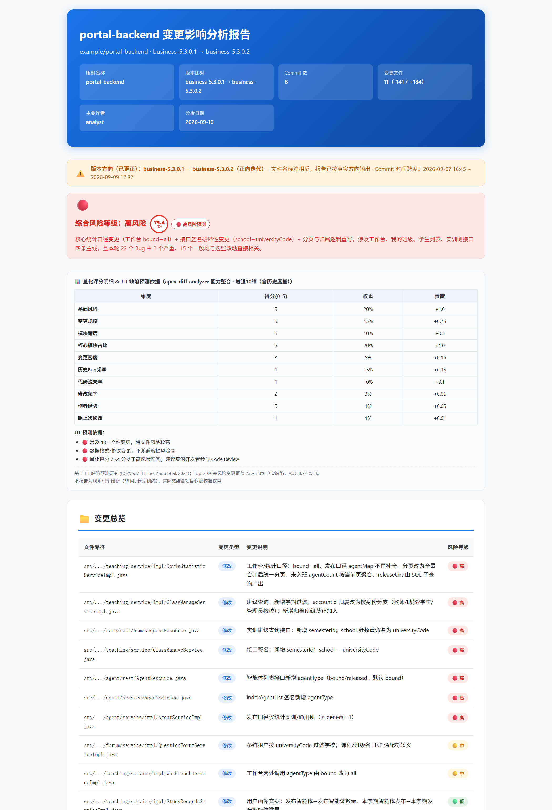
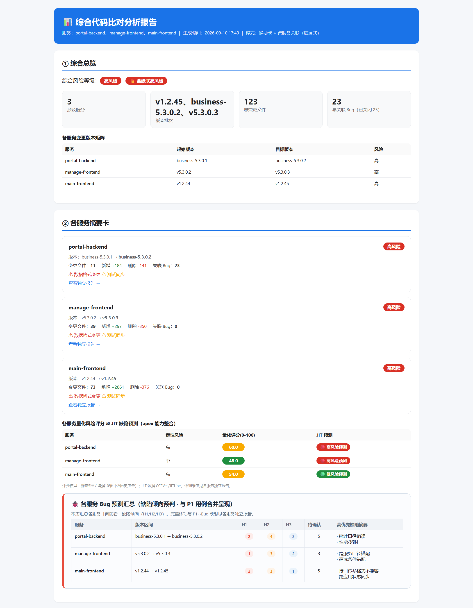

# Code Diff Analyzer — 代码变更影响分析

## 技能概述

分析代码仓库的变更记录（diff / PR / commit log），识别受影响的功能模块，评估风险等级，规划测试范围，输出结构化影响分析报告与 HTML 变更报告。支持区分「变更代码 / 新增代码」、多服务综合比对、Bug 关联与版本趋势、量化风险评分与 JIT 缺陷预测。

> **想知道从哪里开始？** 先看下面的「能力边界与适用性」与「分析流程总览」；要动手时直接看「高频用法」；遇到问题看「常见问题」。

---

## 能力边界与适用性

### ✅ 适用

- **输入格式**：
  - **格式 A** — CI/CD 原始输出 `tagdiff.txt`（含 `======== Commit 记录 =========` / `======== 代码差异 ============` 锚点；v2 含变更概览/模块分布分区）
  - **格式 B** — 结构化 Markdown 报告 `compare_vX_to_Y.md`（含 `### 📄 文件名` 标题 + ```` ```diff ```` 代码块）
- **场景**：版本间代码改动分析、PR/MR 影响范围评估、回归测试范围规划、多服务综合影响分析、Bug 关联与历史趋势分析、报告生成与交付打包。
- **技术栈**：对**文本 diff 通用**；模块依赖启发式规则针对前端（`views/` `components/` `router/` `utils/`）与后端（`controller` `service` `mapper`）常见目录约定。

### ❌ 不适用（避免误用）

- **无对照版本的纯代码阅读 / 解释** → 用通用代码阅读，本技能不做静态扫描。
- **只有文件列表、没有 diff 内容** → 无法区分「变更代码 / 新增代码」，无法评估风险。
- **二进制 / 生成产物 / Lock 文件的*内容*分析** → 这些会被降权或排除（见 Step 6.1 不变量）。
- **跨仓超大规模（数十服务、上万文件）一次性分析** → 请按服务分批。
- **运行时行为 / 性能 / 内存分析** → 本技能是静态文本分析，不是 profiler。

### 📏 规模与限制

| 项 | 约定 |
|---|---|
| 单服务变更规模 | ≤ 10 文件 或 ≤ 400 行属常规；超过会命中高风险规则 R3（阈值见 Step 5.1） |
| 单次综合服务数 | 建议 ≤ 5 个服务；更多请分批 |
| 运行依赖 | 纯对话分析**无依赖**；跑脚本需 Python 3.9+；Bug 导入需 `openpyxl` |
| 数据沉淀目录 | `{workspace}/.workbuddy/diff-analytics/{service}/`（需可写） |

---

## 触发条件

### 必触发（用户明确要分析变更）

- 提供 `git diff` / `git log --oneline` 输出
- 要求分析版本间改动（如 `v1.2.24 → v1.2.25`）或评估 **PR/MR 影响范围**
- 提供 `tagdiff.txt`（格式 A）或 `compare_vX_to_Y.md`（格式 B）
- 询问「这次改动影响了什么」「需要测试哪些功能」
- 要求生成变更报告（Markdown / HTML）

### 按需触发（可选增强层，不改变主流程）

- 导入 Bug 数据：`导入Bug数据` / `@bug_list.xlsx 导入Bug数据`
- 分析历史数据：`分析 diff-analytics` / `服务风险趋势` / `查看变更历史`
- 一次性给出 **≥2 个服务**的比对文件 → 进入「综合比对模式」
- 需要把整包发给他人 → 交付打包（`pack_reports.py`）

### 不触发（避免误用）

- 只要求「读代码 / 解释代码」，没有变更对照
- 只贴文件列表但没有 diff 内容
- 与代码变更无关的其它任务

---

## 分析流程总览

> **先看这张表**：7 个步骤里哪些必做、哪些按需，一眼看清，不必读完全文。

| Step | 名称 | 是否必做 | 产出 |
|---|---|:---:|---|
| 1 | 接收并识别变更内容（格式识别 + **版本方向核查**） | ✅ 必做 | 服务名、真实版本方向、文件/commit 清单 |
| 2 | 变更类型分类 | ✅ 必做 | 新增 / 修改 / 删除 / 回滚 |
| 3 | 变更代码 vs 新增代码分类 | ✅ 必做 | 两类拆分 |
| 4 | 模块依赖分析 | 🟡 建议 | 受影响模块与角色 |
| 5 | 风险等级评估（**走 `scoring.py`**） | ✅ 必做 | 🔴🟡🟢 + 量化分 |
| 5b | 专项校验（回退 / 敏感信息 / 测试同步 / 循环依赖 / 数据格式） | ✅ 必做 | 检测命中结果 |
| 6 | 数据沉淀 | 🟡 按需* | `diff-analytics/{service}/` 记录 |
| 7 | 输出报告（HTML + 增强层注入） | ✅ 出报告时 | HTML 报告文件 |

\* Step 6 仅在**要生成报告 / 做趋势分析 / 维护历史指标 / 用户明确要求沉淀**时执行；只读审查或口头结论默认不写库。

- **最小可用路径（只要结论）**：Step 1 → 2 → 3 → 5（+5b）→ 直接给文字结论。
- **完整路径（出正式报告 + 沉淀）**：Step 1 → 2 → 3 → 4 → 5 → 5b → 6 → 7（7 内含量化/JIT、P1、Bug 预测注入）。

```
输入(diff / tagdiff.txt / compare_vX_to_Y.md)
     │
     ▼
[Step1 识别]──服务名 / 真实版本方向
     ▼
[Step2 分类]──►[Step3 变更vs新增]──►[Step4 模块依赖]
     ▼
[Step5 风险(脚本)]──►[Step5b 专项校验]
     ▼
[Step6 数据沉淀]──────────► .workbuddy/diff-analytics/{service}/
     ▼
[Step7 报告]──────────────► HTML 报告（+ 量化JIT / P1 / Bug预测 注入）
                               │
                               └─► [pack_reports] 结构保真 zip（发给他人时）
```

---

## 分析工作流

### Step 1 — 接收并识别变更内容

**先判格式，再解析内容**：
1. **格式 A**（`tagdiff.txt`）：用 `======== Commit 记录 =========` 与 `======== 代码差异 ============` 两个锚点切分；服务名取自 `仓库地址:` 行末段（去 `.git`）。
2. **格式 B**（`compare_vX_to_Y.md`）：解析「对比概览」表格取服务名/版本；各 `### 📄 文件名` 为文件单元。
3. 提取：服务名、版本信息、Commit 列表、文件列表、代码 diff。

**⚠️ 1.3 版本方向核查（必做，不可跳过）** —— `compare_A_to_B.md` 文件名里的 A/B 顺序**不一定**是真实方向：
- **三步验证法**：① 比较版本号大小（大=新）→ ② Commit 时间线（最晚=新）→ ③ diff 语义（`-` 属旧、`+` 属新）对齐。
- 报告中**必须使用验证后的真实方向**，并在顶部「版本方向横幅」标注 `✅ 与文件名一致` / `⚠️ 与文件名相反（已更正）`。

> 格式 A/B 的完整特征、示例、`格式 A v2` 新增分区、信息提取对照表、方向核查常见情形表、服务名提取规则 → `references/analysis-rules.md`。

### Step 2 — 变更类型分类

| 类型 | 标志 |
|---|---|
| 新增文件 | `new file mode` / `+++ /dev/null` |
| 修改文件 | `@@` 差异标记 |
| 删除文件 | `deleted file mode` / `--- /dev/null` |
| 回滚 | Commit 含 `Revert` |

### Step 3 — 变更代码 vs 新增代码分类（必做，不混在一起）

- **变更代码（Modified）**：对已有逻辑/行为的修改，可能改变现有功能行为 —— 既有 `-` 又有 `+`、改签名/参数/条件/数据结构/常量。风险通常**较高**，关注向后兼容与下游适配。
- **新增代码（Added）**：纯新增逻辑，不改变已有行为 —— 只有 `+`、新增函数/配置/分支/日志。风险通常**较低**，关注新场景覆盖与集成点。
- **判据优先级**：① 是否同一语义单元（同函数/变量/结构）→ ② 是否改变调用方式或返回格式 → ③ 纯新增=新增代码，语义修改=变更代码；**无法确定时标「混合类型」并取较高风险**。

> 分类增强规则（误判场景对照表）与 6 个判断示例 → `references/analysis-rules.md`。

### Step 4 — 模块依赖分析

按路径与职责识别模块角色：常量/配置（`constants/`、`config/`）→ 所有引用处受影响；路由（`router/`）→ 跳转与微应用集成；工具函数（`utils/`）→ 所有调用方；组件（`views/`、`components/`）→ 使用页面；服务/API（`services/`、`api/`）→ 所有业务调用方；类型声明（`*.d.ts`）→ 静态检查与运行时。

### Step 5 — 风险等级评估（走脚本，不靠现场判断）

> **2026-09-18 起**：本规则已下沉到 `scripts/scoring.py` 的 `rate_change()`（确定性、可复现）。
> **agent 调用脚本取结果，不再自行判定风险等级。**

```bash
python scripts/scoring.py          # 自检输出：量化分 + 评级 + 评级理由
```

规则（按优先级，命中即返回；版本号见 `rating_rules_version`，当前 **1.1**）：

| 规则 | 命中条件 | 结果 |
|---|---|---|
| R1 | 触及认证/权限/支付/订单核心逻辑 | 🔴 高 |
| R2 | 数据格式/协议/契约变更（proto / dto / schema / sql / locale zh·en.json） | 🔴 高 |
| R3 | 变更规模大：> **400** 行 或 > **10** 文件 | 🔴 高 |
| R4 | 高风险模块**占比 ≥ 1/3 且数量 ≥ 2** | 🔴 高 |
| R5 | 变更规模中等：> **150** 行 或 > **5** 文件 | 🟡 中 |
| R6 | 存在高风险模块（数量 ≥ 1，但未达 R4） | 🟡 中 |
| R7 | 仅涉及样式/文案（`*.css/scss/svg`、theme/token/palette） | 🟢 低 |
| — | 其余 | 🟢 低 |

- **上下文增强**：可在报告中补充叙事（如「虽命中 R1 但实为工具函数」），但**不得覆盖脚本结论**。
- **若认为脚本评级不符**：先看 `rate_change()` 返回的 `reasons`；需调规则时改代码并升 `RATING_RULES_VERSION`，改完对全部服务重跑 `doctor.py --all --fix`。阈值 1.0→1.1 的重标定原因见 `references/changelog.md`。

### Step 5b — 专项校验（必须执行）

五项必查，命中即在报告「专项检测结果」节输出：

1. **数据格式变更** —— JSON/Schema/接口/协议字段增减、类型变化 → 字段级对比表 + 兼容性评估。
2. **版本回退** —— 目标版本 < 源版本 → 🚨 警告 + 回退原因 + 影响功能。
3. **敏感信息泄露** —— 密码/密钥/私钥/连接串/身份证/手机/银行卡模式 → 🚨 安全警告 + 脱敏建议（**不可展示完整敏感内容**）。
4. **测试文件同步** —— 业务代码变更但无对应测试变更 → ⚠️ 建议补测。
5. **循环依赖** —— 同 commit 内互相引用的两模块同时被改 → ⚠️ 架构警告 + 重构方向。

> 各检测的触发条件、关键词/正则、伪代码与输出格式 → `references/analysis-rules.md`。

### Step 6 — 数据沉淀（按需执行）

**触发**：生成报告、趋势分析、维护历史指标或用户明确要求沉淀时执行；只读审查默认不写库。

写入位置与三个业务文件：

```
{workspace}/.workbuddy/diff-analytics/{service}/
├── service_metrics.json    ← 每次分析追加一条 records（文件头：service + schema_version + records）
├── version_chain.json      ← 追加版本关系（… + versions）
├── file_history.json       ← 更新文件变更记录（… + files）
├── version_bugs.json       ← 流程 A 导入（可无）
└── cross_reference.json    ← 流程 B 映射产物（可无，由脚本全量重建）
```

**三条不变量（写入必须遵守）**：
1. **版本键唯一写法**：跨文件比较**必须先过** `_common.norm_version()`（否则会重现「49 个 Bug 有效关联 0 个」）。
2. **`risk_score` 由脚本产出，禁止手填**：走 `scoring.canonical_risk_score()` 并写血缘 `risk_score_source`；旧公式值仅留档 `risk_score_legacy`。
3. **变更文件清单不含输入产物**：`*tagdiff*.txt` / `temp_*` / `_build_*` / `*.bak/.pyc` 硬排除；非逻辑文件（lock/构建/静态资源/文档/`*.html`）**保留但降权，不得剔除**（剔除会破坏「`file_history` 条目数 == `files.changed`」自检）。

**两个 `risk_score` 口径（不可混用）**：

| 字段 | 口径 | 用途 |
|---|---|---|
| `metrics.risk_score` | 静态 5 维（`risk_score_mode: "static"`） | **趋势连线唯一口径** |
| `metrics.risk_score_enhanced` | 增强 10 维（有历史度量时） | 单份报告展示，**禁止参与趋势连线** |
| `metrics.risk_score_legacy` | 旧公式 `min(100, high*10+medium*5+low*1)` | 仅历史审计 |

**维护工具（按需调用）**：

```bash
python scripts/sync_analytics.py --service <svc>          # 重建 file_history + 归一版本键 + 重算 risk_score
python scripts/sync_analytics.py --all --backfill         # 全部服务；--backfill 从历史报告回填 files（仅可完整还原的）
python scripts/doctor.py --all                            # 一键体检 D1–D9（只读）
python scripts/doctor.py --all --fix --move-temp          # 体检 + 自动修复 + 临时产物移入 _trash/（可逆）
python scripts/verify_precision.py --all                  # 精度标定（样本 < 30 拒绝给权重建议）
python -m pytest scripts/tests/ -q                        # 回归；项数以当前输出为准
```

**何时必跑**：① 改了 `scoring.py` / `quant_jit_risk.py` 评分规则 → 必须 `--all --fix` 重算；② 报告分与最新代码不一致（**D8 会报**）→ 同上；③ 交报告前跑一次 `doctor --all`。

> 存储位置细节、写入步骤（6.2.1–6.2.3 各文件字段）、写入校验 → `references/data-sink.md`；Schema 定义见 `references/analytics-schema.md`。

### Step 7 — 输出分析报告

**报告结构（顺序）**：
1. **版本方向核查横幅**（**必须是报告第一个可见内容**）—— 真实方向 + 是否与文件名一致 + Commit 时间跨度；一致用 `direction-ok`（绿），相反用 `direction-warn`（橙）。
2. 版本信息表格（服务名 / 版本比对 / 构建信息）
3. **风险等级横幅**（🔴高 / 🟡中 / 🟢低）
3.5 **量化风险评分 & JIT 缺陷预测**（`gen_quant_jit.py` 注入；分数环 + JIT 标签合并进风险横幅，维度贡献表置于「变更总览」前）
4. 变更总览表（文件 + 类型 + 统计 + 说明 + 风险）
5. 代码差异详情（语法高亮 diff）
6. 分类影响分析（变更代码分析 + 新增代码分析，JSON 结构）
7. 数据格式变更详解（如有）
8. 专项检测结果（回退 / 敏感信息 / 测试缺失 / 循环依赖）
9. 分优先级测试建议表（P1 必测 / P2 建议 / P3 可选）
10. 资深开发者建议

**HTML 报告生成**：按 `references/html-report-template.html` 生成**单文件、无外部依赖**的 HTML（CSS 内联、diff 高亮、中文界面）。输出路径：
`{workspace}/report/code-diff/{service}/{service}_{旧版本}_to_{新版本}_变更影响分析报告.html`

生成后**按需注入增强层（均幂等，可重复执行）**：

```bash
# ① Bug 趋势（先判服务数：≥2 服务归综合报告，仅 1 服务才注入单服务报告）
python scripts/bug_trend.py --service {svc} --report {报告.html}
python scripts/bug_trend.py --combined --services {A} {B} --report {综合报告.html}
python scripts/bug_trend.py --strip --report {老报告.html}          # 撤走已注入的单服务 Bug 区块

# ② 量化风险 & JIT 预测（默认每次都跑；--from-metrics 与趋势分同源，首选）
python scripts/gen_quant_jit.py --report {报告.html} --from-metrics --service {svc} --services {svc}

# ③ Bug 预测（缺陷倾向预判，与 P1 合并呈现，置于 P1 之前）
python scripts/gen_bug_predict.py --report {报告.html} --data-file bug_predict.json

# ④ P1 用例预测（必须；具体卡片版 + 知识库命中核对）
python scripts/gen_p1_cases.py --report {报告.html} --data-file p1_cases.json

# ⑤ 交付打包（结构保真，禁止拍平）
python scripts/pack_reports.py --root "{workspace}/report/code-diff" \
  --bundle "码上{版本}影响变更报告_{日期}" --out ".../{bundle}.zip" \
  --file "portal-backend/xxx_报告.html" --file "_综合/综合比对分析报告_xxx.html"
```

**必须记住的三条**：
- **Bug 归口**：≥2 服务时 Bug 数据只归口综合报告；单服务报告不挂 Bug 区块。
- **P1 用例必须具体**：每条含 编号/模块/场景/代码点/测试数据/步骤/预期；知识库按**目标版本**动态定位并逐条核对，未命中设 `estimated:true`。
- **口径同源**：报告分一律用 `--from-metrics`，不要用 `--auto`（实测差 5 倍）。

> 报告结构/分类 JSON 格式 → `references/report-format.md`；HTML 生成与各增强层注入的完整命令、占位符、字段结构 → `references/report-injection.md`。

---

## 综合比对模式（多服务一次性分析）

**触发**：用户一次性提供 **≥2 个服务**的比对文件（格式 A/B 可混用）。单份文件不触发，仍走单服务流程。

**流程**：
1. 对每个服务分别执行 Step 1-7 单服务分析，生成独立报告并按需沉淀。多服务模式下**单服务报告不注入 Bug 趋势**（历史已注入的用 `bug_trend.py --strip` 撤走）。
2. 汇总综合报告：

```bash
python scripts/gen_combined_report.py --services 服务A 服务B 服务C --workspace <工作区>
```

**综合报告结构**：① 综合总览（服务数 / 版本矩阵 / 综合风险 / 总文件数 / 总关联 Bug）② 各服务摘要卡 ③ 跨服务关联与级联风险 ④ 统一测试优先级（P1 必测）⑤ 各版本 Bug 数据明细（仅 ≥2 服务时；`<!-- BUG_TREND_COMBINED -->` 注入）⑤.5 P1 用例预测 ⑥ 综合发布建议。

**风险聚合**：综合风险底线 = `max(各服务最新版本风险)`；高风险且存在跨服务关联 → 标注「🔥 含级联高风险」。

**输出位置**：`report/code-diff/_综合/综合比对分析报告_{服务1}_{服务2}_..._{YYYYMMDD}.html`（仍保留各服务独立报告）。

**⚠️ 跳转链接（可移植化）**：默认**相对路径** `../{service}/xxx.html`（`_综合/` 与 `{service}/` 同级，整目录拷贝即可用）；`--absolute` 回退本机绝对路径（仅本地预览，**不可分享**）。打包分享**必须结构保真**（用 `pack_reports.py`），拍平会断链。

---

## 独立流程 A / B / C（按需触发）

- **流程 A — Bug 数据导入**（可选增强层）：支持 Excel/CSV / 逐条录入 / 粘贴表格；统一用 `bug_correlate.py` 以 xlsx 权威状态为准（禁止手工推断状态）。多服务归属：无可靠服务列时整份写入 `_project` 项目级池，避免 Bug 数翻倍。
- **流程 B — 映射引擎**（导入后自动触发）：驱动源为 `service_metrics.json` 的 `records`；跨文件比较先归一版本键；父版本 Bug **只作上下文、绝不并入分子**；`module` 列全空时诚实退化为「版本级归因」。
- **流程 C — 数据分析**（随时触发，`分析 diff-analytics` / `服务风险趋势`）：基础层 4 维（风险热力图 / 版本链趋势 / 高频文件 / 专项检测命中）始终可用；有 Bug 数据时叠加增强层 4 维（Bug 密度 / 变更-Bug 关联率 / 修复效率 / 缺陷预测）。趋势统计固化脚本 `bug_trend.py`。

> 流程 A/B/C 的完整字段表、命令、归档规则与产物 schema → `references/flows-abc.md`。

---

## 脚本编排与数据流

**编排 4 / 共 12**：`pipeline_wrapper.py` 只编排 4 个固化脚本，其余 8 个由本技能按步骤单独调用。

```
输入 ──► 语义分析(LLM: Step1–5) ──► service_metrics.json
                                          │
        ┌─────────────────────────────────┼──────────────────────────┐
        ▼                                 ▼                          ▼
 bug_correlate.py ──► version_bugs.json  │              gen_quant_jit.py ──► 量化/JIT 区块
        │            cross_reference.json │              gen_bug_predict.py ─► Bug预测区块
        ▼                                 ▼                          │
 bug_trend.py ─────────► 趋势区块 ────────┤                          │
 gen_p1_cases.py ───────────────────────► ├──────────► HTML 报告 ◄────┘
 gen_combined_report.py ─────────────────►┘           （多服务综合报告）
        │
        ▼
 pack_reports.py ──► 结构保真 zip（含解压后链接自检）
```

**基础能力模块（禁止在各脚本里另起一份实现）**：

| 模块 | 职责 | 为什么必须共用 |
|---|---|---|
| `scripts/_common.py` | 版本键归一 `norm_version()`；路径过滤 `is_junk_path()` / `filter_change_files()` | 写法不一致曾致 **Bug↔变更 0 关联**；过滤口径分散会破坏条目数自检 |
| `scripts/scoring.py` | 唯一 `risk_score` 口径 `canonical_risk_score()`；R1–R7 评级 `rate_change()` | 曾两套分并存且由 LLM 手填，同一 diff 两次跑可能不同等级 |
| `scripts/sync_analytics.py` | file_history 重建 / 版本键归一 / risk_score 重算 | 手工维护导致条目非确定性丢失 |
| `scripts/doctor.py` | 一键体检 D1–D9 + 可逆修复 | **D8 专抓「代码改了数据没重算」** |
| `scripts/verify_precision.py` | 真实命中率 / 检测精度 / 权重建议（样本<30 拒绝） | 让「精度」可被度量 |
| `scripts/cdx_errors.py` | 统一友好错误层：`read_json` / `read_text` / `open_xlsx` / `guard` | 把原生 traceback 转为「文件+行列+成因+修复建议」的中文提示 |
| `scripts/tests/` | pytest 回归集（合成工作区复刻历史缺陷） | 锁死「0 关联」「空壳 mapping」等回归 |

**其余脚本一览**：`bug_correlate` `bug_trend` `gen_combined_report` `gen_p1_cases`（编排内）；`gen_bug_predict` `gen_quant_jit` `quant_jit_risk` `gen_midscene_yaml` `doctor` `sync_analytics` `verify_precision` `pack_reports`（按需）。`cdx_errors` / `_common` / `scoring` 为共用模块。

---

## 输出与报告示例

生成的 HTML 报告长这样（真实产物截图，数据已脱敏）：

**单服务报告**（版本方向横幅 → 风险等级 + 量化分/JIT → 变更总览）：



**多服务综合报告**（跨服务总览 + 各服务摘要卡）：



- **完整输出示例**（报告各章节的实际文字样例）→ `references/output-examples.md`。
- **HTML 报告模板**（单文件、内联 CSS、diff 高亮）→ `references/html-report-template.html`。
- 报告为**单文件自包含**，双击即可打开、可直接分享；综合报告的跨服务跳转依赖同级目录（打包务必结构保真）。

> 报告各章节的顺序与要求见「Step 7」。

---

## 高频用法（一句话 → 预期产出）

| 你说 | 会得到 |
|---|---|
| 「分析这次 `v1.2.24 → v1.2.25` 的改动，告诉我影响范围」 | 影响分析结论（模块 / 风险 / 测试建议），不落文件 |
| 「分析 `tagdiff.txt`，生成 HTML 变更报告」 | 单服务 HTML 报告（含风险横幅 + 量化分 + P1 用例 + Bug 预测） |
| 「主框架 + 前端 + 后端三份 diff 一起分析」 | 3 份单服务报告 + 1 份**综合比对分析报告**（Bug 归口综合） |
| 「`@bug_list.xlsx` 导入 Bug 数据，再分析 diff-analytics」 | 导入 `version_bugs.json` + 重建 `cross_reference.json` + 版本 Bug 趋势 |
| 「看下服务风险趋势 / 查看变更历史」 | 风险热力图 + 版本链趋势 + 高频文件追踪 |
| 「把整包报告打成 zip 发我」 | 结构保真的报告 zip（含 `使用说明.txt` + 链接自检） |

---

## 常见问题（速查）

- **裸文本「）。 -->」泄漏** → 注释体内禁止 `-->`；写盘守卫会拦截；**修模板源头**。
- **报告分与趋势分不一致** → 用 `gen_quant_jit --from-metrics`（同源），别用 `--auto`。
- **Bug 关联全为 0** → 版本键写法不一致；跨文件比较先 `norm_version()`。
- **趋势线 `mode_mixed` 横幅** → 静态/增强口径混用；跑 `doctor --all --fix`。
- **解压后链接打不开** → 打包必须结构保真，不要拍平。
- **改了脚本投稿包没带上** → 只改 C 盘真源，重新走 `skill_publish_prep`。

> 共 20 条「现象 → 原因 → 处理」→ `references/faq.md`。

---

## 注意事项

- **【版本方向】** 文件名方向 ≠ 实际方向，必做 Step 1.3 三步验证；`-` 恒属旧版本、`+` 恒属新版本。
- **【两类代码】** 变更代码与新增代码必须分开分析，不混在一起。
- **【数据格式/存储】** 字段增减必须给字段级对比表；存储 schema 变更必须评估下游兼容性。
- **【专项校验】** 回退 / 敏感信息 / 测试同步 / 循环依赖 必须执行；敏感内容脱敏展示。
- **【数据沉淀】** 按任务意图执行：生成报告/趋势/用户要求才写库，只读审查默认不写。
- **【Bug 数据】** 可选增强层；服务级与项目级池均无数据时仅输出基础层。
- **【完整性】** 写入前校验 JSON 合法、写入后校验数组长度 +1；失败**不阻塞报告输出**。
- 不确定的影响范围标注「（不确定，需进一步验证）」；涉及微前端路由变更需特别标注集成风险。

---

## CI / 容器化流水线

`scripts/pipeline_wrapper.py` 是**统一入口**，编排 4 个确定性脚本，分 `analyze / score / report / all` 三阶段：

```bash
python scripts/pipeline_wrapper.py --stage all --service portal-backend --xlsx bug.xlsx
python scripts/pipeline_wrapper.py --stage analyze --service portal-backend --repo-url <url> --target-tag v1.1
```

- **定位**：LLM 前置（Step 1-7 语义分析），流水线**只做确定性执行**，不在发布链路内跑 LLM。
- **退出码**：`0` 成功 · `1` 参数错误 · `2` analyze 交接未就绪（`service_metrics.json` 缺失，CI 门禁据此区分「前置没做」与「脚本报错」）· 其它透传子脚本。
- **豁免**：`--allow-missing-metrics` 跳过阻断（降级警告 + 退出码 0）。
- **容器化**：`scripts/Dockerfile`（`python:3.11-slim` + openpyxl，`ENTRYPOINT` → `pipeline_wrapper.py`）。
- **现状**：编排与镜像**已就绪**，但**尚未接入真实 CI**（无 Jenkinsfile / `.gitlab-ci.yml`）；上游 `tagdiff.sh` 与本技能是**上下游**关系，非同一条流水线。

> 分阶段命令、退出码表、容器用法、与上游关系 → `references/ci-pipeline.md`。

---

## 参考资源

**细则文档（按需加载，普通分析无需读）**：

| 文件 | 内容 |
|---|---|
| `references/analysis-rules.md` | Step 1 格式识别细则 / Step 3 分类增强示例 / Step 5b 专项校验细则 |
| `references/data-sink.md` | Step 6 数据沉淀细则（写入步骤 / 字段 / 校验） |
| `references/report-format.md` | 报告结构（7.1）与分类 JSON 格式（7.2） |
| `references/report-injection.md` | HTML 生成与各增强层注入的完整命令 / 占位符 / 字段 |
| `references/flows-abc.md` | 独立流程 A / B / C 细则 |
| `references/ci-pipeline.md` | CI / 容器化流水线细则 |
| `references/faq.md` | 常见问题 / 易错点汇总（20 条） |
| `references/changelog.md` | 历史设计决策与修复记录（排查历史口径时读） |
| `references/analytics-schema.md` | 数据文件 Schema 定义 |
| `references/init-analytics.md` | 数据目录初始化说明 |
| `references/output-examples.md` | 报告各章节实际输出样例 |
| `references/prompt-template.md` | 提示词模板 |
| `references/html-report-template.html` | HTML 报告模板（写盘守卫依赖其干净） |

**关键脚本**：`pipeline_wrapper.py`（编排入口）· `scoring.py`（评分/评级）· `cdx_errors.py`（友好错误层）· `_common.py`（版本键/路径过滤）· `sync_analytics.py` / `doctor.py` / `verify_precision.py`（数据体检）· `bug_correlate.py` / `bug_trend.py` / `gen_combined_report.py` / `gen_p1_cases.py` / `gen_bug_predict.py` / `gen_quant_jit.py` · `pack_reports.py`（打包）。
